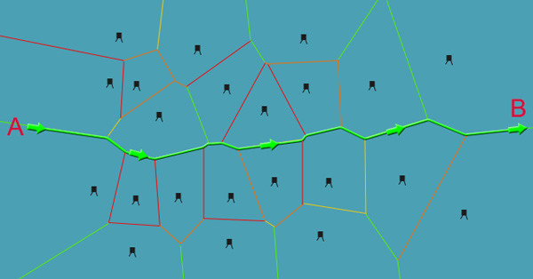
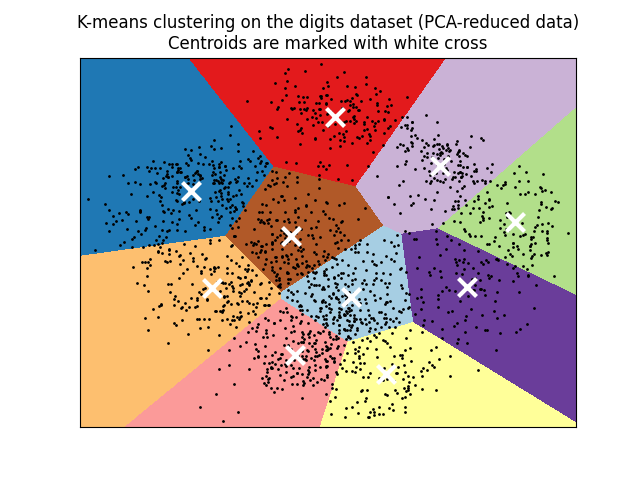
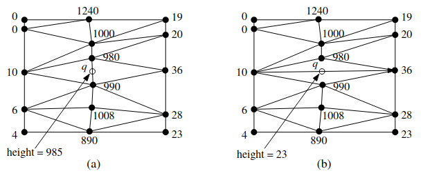
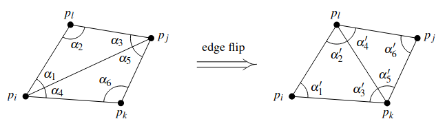
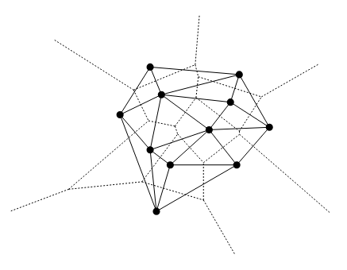
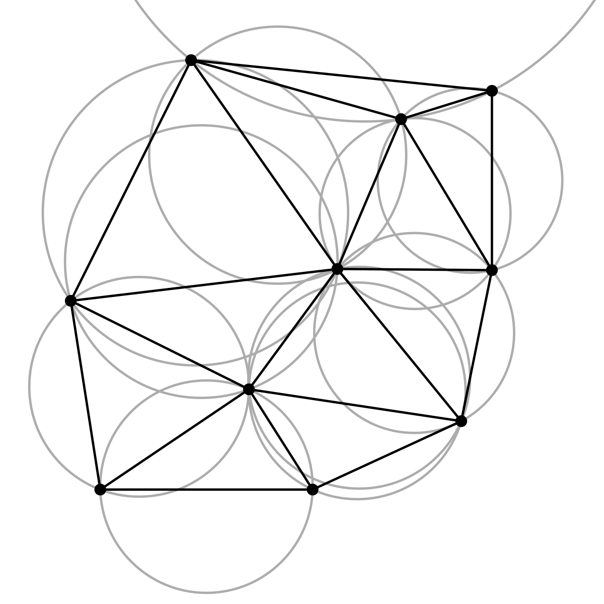

# Ближайшие точки за O(n)

# Диаграмма Вороного

Пусть есть карта города, на которой точками обозначены почтовые отделения. Человек хочет отправить письмо, и он пойдёт на ближайшую почту. Ему интересно знать, какое отделение ближе, для любой точки города — необходимость отправить письмо может наступить неожиданно. Для этого он может взять карту и расчертить её на ячейки так, чтобы внутри каждой ячейки находилось только одно отделение, а для всех остальных точек ячейки именно эта почта была ближайшей.

## Свойства

- $h(p, q)$ - открытая полуплоскость серединного перпендикуляра к $pq$, тогда ячейка $V(p_i) = \cap_{1 \leq j \leq n,~j \neq i}~h(p_i, p_j)$.
- Если все $n$ вершин из набора $P$ лежат на одной прямой, то $Vor(P)$ состоит из $n-1$ параллельной прямой. Иначе диаграмма Вороного связна, и ее ребра являются отрезками или лучами.
- При $n \geq 3$ количество вершин диаграммы не больше $2n - 5$, а ребер не больше $3n - 6$.
- Для диаграммы Вороного $Vor(P)$ множества точек $P$ выполняется:
    1. Точка $q$ вершина диаграммы $\Leftrightarrow$ на границе наибольшего пустого круга $C_P(q)$ лежит хотя бы 3 точки 
    2. Серпер к $p_i,~p_j$ содержит ребро диаграммы $\Leftrightarrow$ существует точка $q$ на серпере такая, что на границе $C_P(q)$ только $p_i,~p_j$.

## Примеры

## Построение

- Гениальный и простой алгоритм за O(n^2)

# Триангуляция Делоне

Какая триангуляция лучше? С точки зрения моделирования ландшафтов узкие треугольники иногда кажутся обманчивыми, поэтому мы будем сравнивать триангуляции по наименьшему углу, а если они равны, то по следующиму наименьшему и так далее.

## Полезные мысли

- $C$ - окружность с точками $a,~b$. С одной стороны от $ab$ лежат $p,~q,~r$ так, что $p$ внутри $C$, $q$ на ней, а $r$ - снаружи. Тогда $\angle apb > \angle aqb > \angle arb$.
- Ребро между двумя треугольниками, образующими выпуклый четырехугольник, **неправильное**, если $\displaystyle \min_{1 \leq i \leq 6} \alpha_i < \min_{1 \leq i \leq 6} \alpha_i'$.

- Вектор из отсортированных по возрастанию углов триангуляции $(\alpha_1,\alpha_2, \ldots, \alpha_{3m})$ будем обозначать $A(T)$. При флипе неправильного ребра $A(T') > A(T)$.
- Если $abc$ и $abd$ в триангуляции, и $d$ внутри окружности $abc$, то $ab$ - неправильное. Также в любом выпуклом четырехугольнике одна из диагоналей неправильная. Теперь понятно, как сделать триангуляцию без неправильных ребер с помощью флипов.

## Свойства

- Для диаграммы Вороного определим граф Делоне. Он планарный. Если точки были в общем положении (нет 4 точек на окружности), то это триангуляция.

- Для набора точек $P$:
    1. Точки $p,~q,~r$ вершины одной грани в графе Делоне $\Leftrightarrow$ окружность $pqr$ не содержит точек внутри
    2. Ребро $pq$ в графе Делоне $\Leftrightarrow$ существует окружность через $p,~q$, не содержащая других точек.
- $T$ триангуляция Делоне $P$ $\Leftrightarrow$ окружность вокруг любого треугольника $T$ не содержит других точек $\Leftrightarrow$ триангуляция не содержит неправильных ребер.

- $A(T)$ оптимально $\Rightarrow$ $T$ триангуляция Делоне. А триангуляция Делоне максимизирует минимальный угол.

## Построение

- Алгоритм постепенного построения триангуляции делоне. Есть всеобъемлющий треугольник. Поддерживается для каждой точки содержащий ее треугольник. На каждом шаге добавляется новая точка, перестраивается триангуляция. Корректность и сложность.
- триангуляций на плоскости и 3D-convex-hull-на-параболе

## Применение

- EMST
- для каждой точки из A найти ближайшую из B

# Алгоритм Эндрю и алгоритм Чена построения выпуклой оболочки 2d

# Алгоритмы с многоугольниками за log

- Проверить, внутри ли точка O(logn)
- Касательная к многоугольнику за O(logn)