### Решето Эратосфена за O(n)

Быстренько повторяем базу

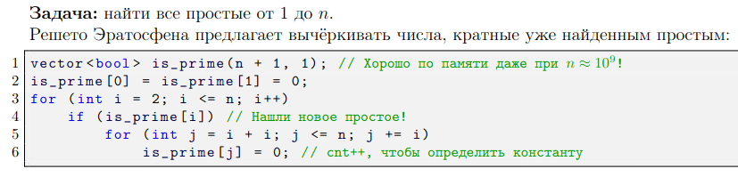 

Факторизация за корень

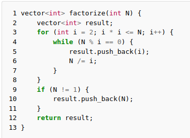 

И делаем с наименьшими делителями. Тут надо нарисовать деревья всех чисел, полученные отношением a = p(a) * b

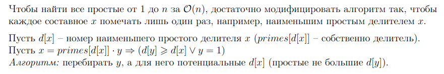 

 

### Диафантово уравнение ax + by = c

Сводим к этому

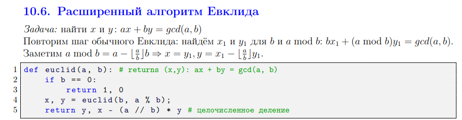 

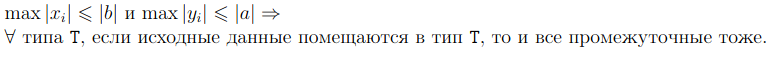 

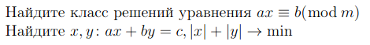 

Частный случай одной из предыдущих тасок и тизер к функции эйлера

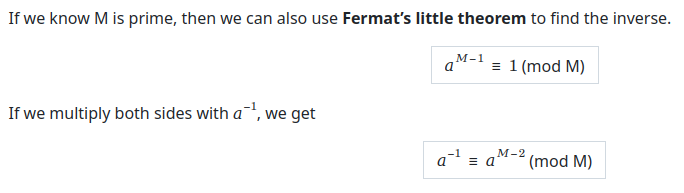 

### Китайская теорема об остатках

Здесь будет доказательство КТО и сведение расширенной версии к базовой

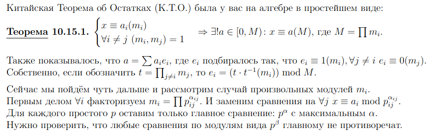 

### Теорема Эйлера

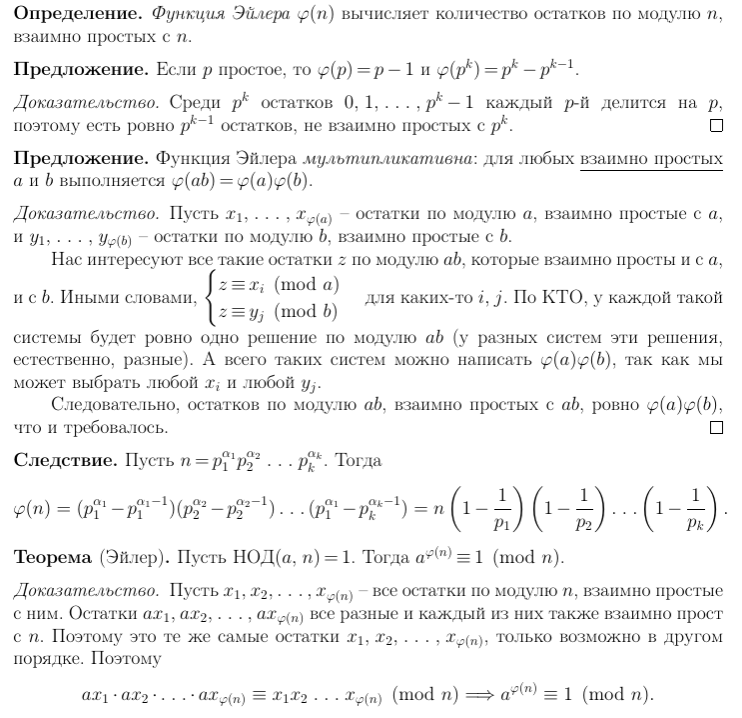 

Малая теорема Ферма получается как следствие.

Еще пару слов про мультипликативные функции

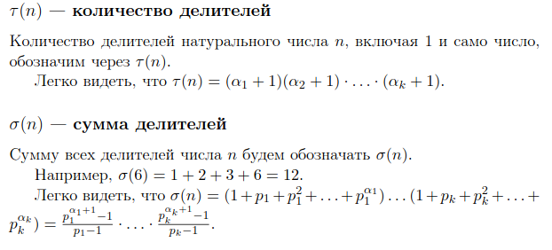 

### Тесты на простоту (если успеем)

Пара слов про проверку за корень.

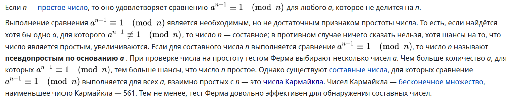 

