### Бинарное дерево поиска

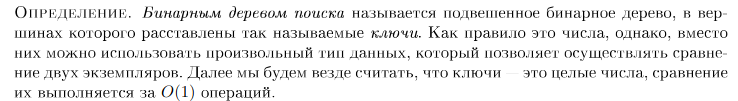 

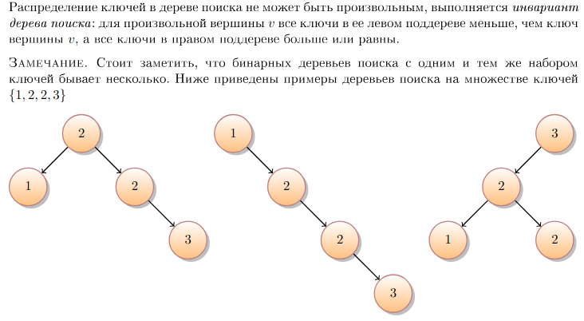 

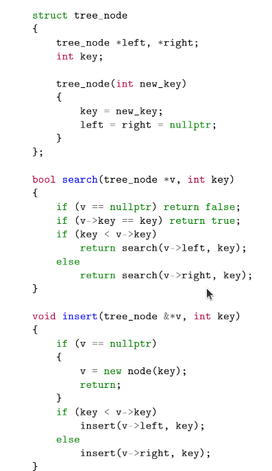 

Сказать про время работы за высоту и балансировку.

### Декартово дерево

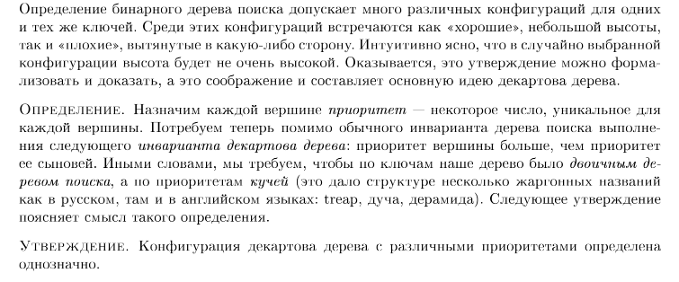 

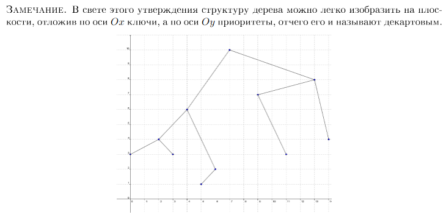 

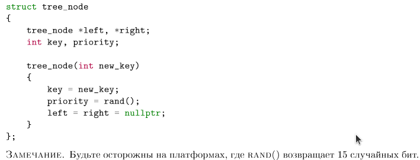 

Как эффективно вставить элемент?

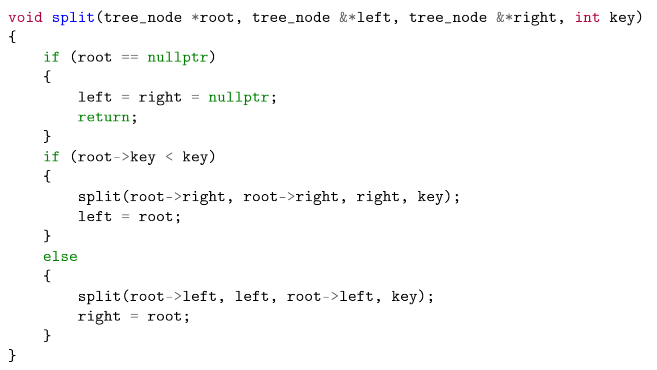 

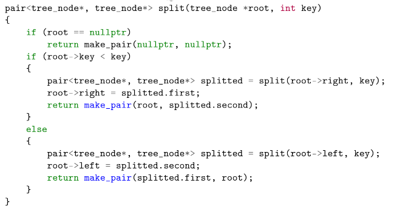 

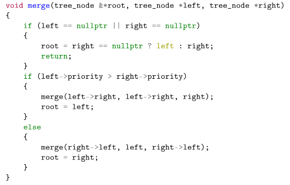 

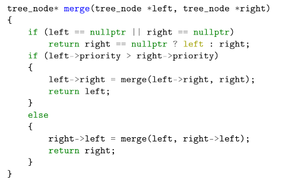 

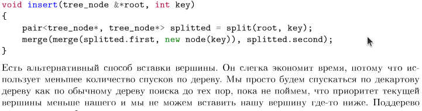 

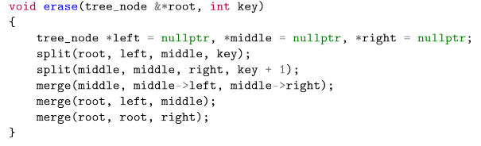 

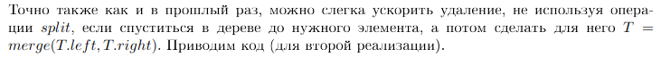 

Вот и получился std::set

### Подсчет функций на примере gcd и суммы

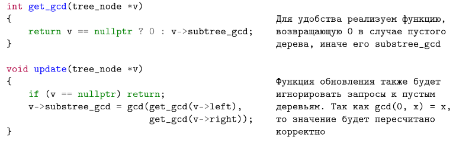 

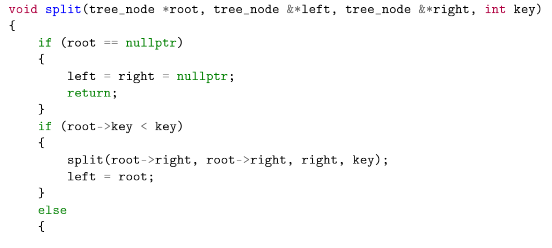 

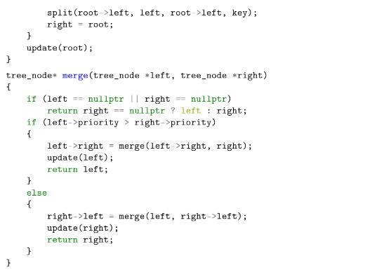 

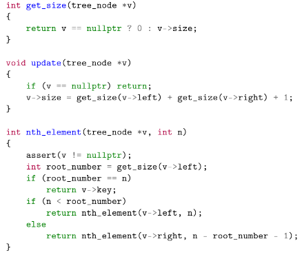 

### Построение за O(n) идейно

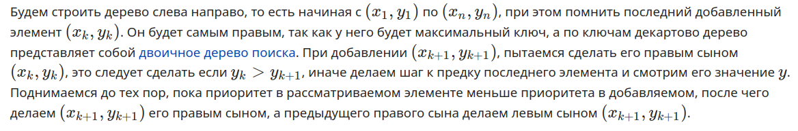 

Каждую вершину типа не более 2 раз посещаем